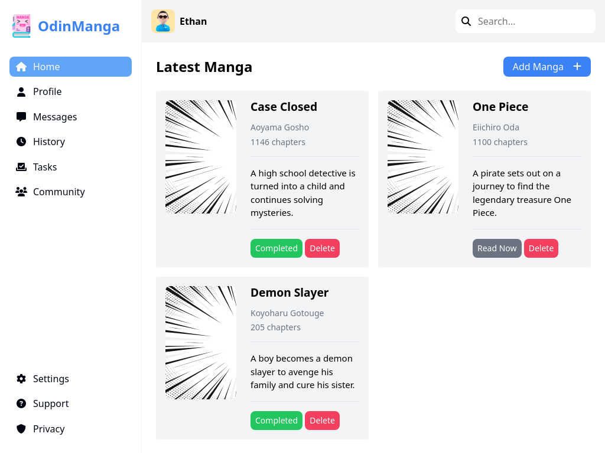

# odin-library

A responsive manga library dashboard project built as part of [The Odin Project](https://www.theodinproject.com/) curriculum.

## [🖥️ Live Demo](https://issakass.github.io/odin-library/)

## 🚀 Features

- Add, delete, and mark manga as read/unread
- Responsive layout for desktop and mobile
- Modern dashboard UI design
- Dialog-based form for adding manga

## 📚 Sample Manga Included

- **Case Closed** by Aoyama Gosho
- **One Piece** by Eiichiro Oda
- **Demon Slayer** by Koyoharu Gotouge

## 🛠️ Built With

- **HTML5**
- **CSS3** (Flexbox & Grid)
- **JavaScript (ES6+)**

## 💡 Future Improvements

- Add search and filter functionality
- Save manga list to `localStorage`
- Improve accessibility (ARIA roles, keyboard navigation)
- UI polish and animations
- Edit manga entries

---

Feel free to fork, contribute, or open issues!
